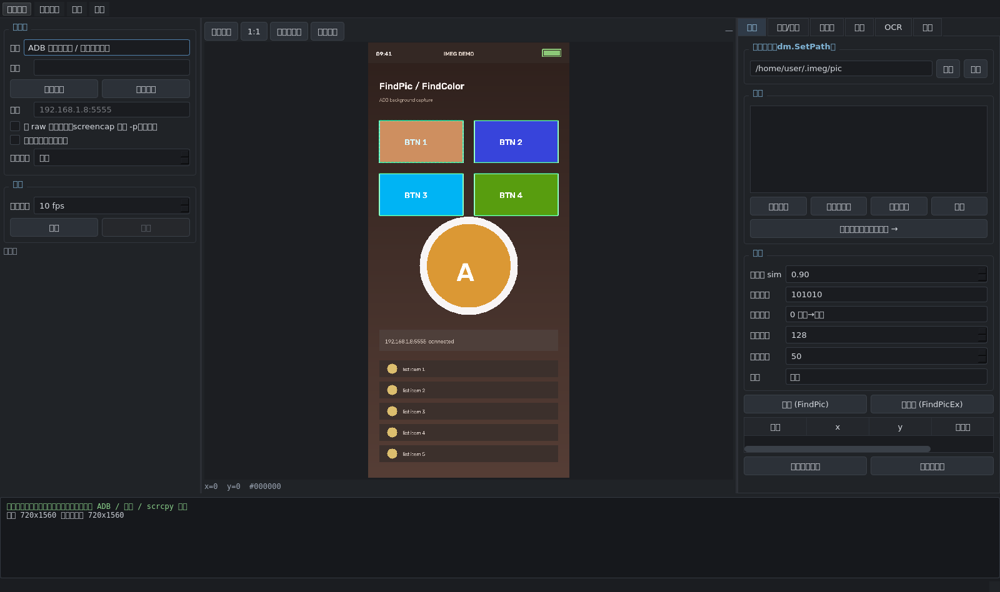
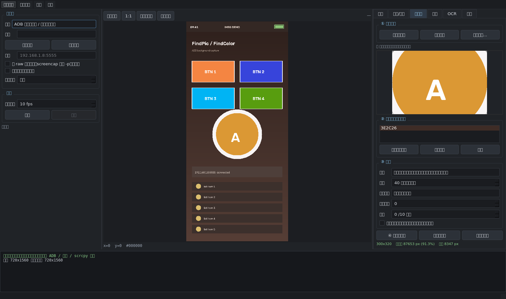

# IMEG

大漠（dm.dll）风格的 **图色 / 控制工具**，用 Python 写成，图形界面 + 脚本双用。

三个你提到的诉求都能落地：

| 需求 | 实现 |
|---|---|
| **连线 ADB** | 设备列表 / 无线 `adb connect IP:5555` / 自动选设备 |
| **背景截图** | `adb exec-out screencap` 本身就是后台的：窗口不用在最前台、可以被别的窗口完全盖住；Windows 模拟器还能走 `PrintWindow(PW_RENDERFULLCONTENT)` 后台抓窗口 |
| **不连 ADB 也要拿到实际解析度图片** | 三种源任选：① 直接抓模拟器窗口，自动定位渲染子窗口、裁掉标题栏工具栏，并可把画面缩放回设备真实解析度 ② scrcpy 投屏流（设备端编码，原生分辨率、低延迟）③ 本地图片离线做模板 |
| **支援做透明图** | 「透明图」页签：点一下背景色 → 调容差 → 边缘连通/全局同色 → 羽化 → 存成带 alpha 的 PNG。`FindPic` 会自动把透明区排除在匹配之外（跟大漠透明图一个语义） |

界面截图（离屏渲染，非真机）：






---

## 1. 安装

```bash
python -m venv .venv
.venv\Scripts\activate            # Linux/macOS: source .venv/bin/activate
pip install -r requirements.txt

# 可选：OCR（推荐，中文效果最好，纯离线）
pip install -r requirements-ocr.txt
```

依赖：`numpy`、`opencv-python-headless`（想用 `cv2.imshow` 就装 `opencv-python`）、`PySide6`、`Pillow`、`psutil`。
不需要 `pywin32` —— Windows API 全部用 `ctypes` 直接调。

**运行界面：**

```bash
python -m imeg            # 或 pip install -e . 之后直接 imeg
```

**ADB**：把 `adb` 放进 PATH，或设置环境变量 `ADB` / `ANDROID_HOME`（会自动找 `platform-tools/adb`），也可以直接丢到 `tools/platform-tools/adb.exe`。

---

## 2. 三种截图源（左上角「截图源」面板）

### ① ADB 截图 —— 后台截图 + 设备真实解析度

* 走 `adb exec-out screencap -p`，拿到的就是设备当前输出分辨率（如 1080×2400）
* 勾选「raw 快速截图」会改用 `screencap` 原始 RGBA，比 PNG 快 2~5 倍
* 面板会实时显示 **画面尺寸 / 设备解析度（wm size）/ FPS / 单帧耗时**
* 「最大宽度」可把大图等比缩小，省 CPU（图色坐标会自动按比例换算）

> ADB 截图天然是后台的：只要屏幕是亮的、不是 DRM/安全页面（某些视频 App、银行 App 会屏蔽），就能出图。

### ② 模拟器窗口捕获 —— 不连 ADB

* `PrintWindow(PW_RENDERFULLCONTENT)` 后台抓窗口：**被遮挡、最小化、不在前台都能抓**
* 「自动定位渲染子窗口」会自动找到模拟器里真正的画面子窗口（雷电/MuMu/夜神/蓝叠/WSA），把标题栏、右侧工具栏、黑边全部裁掉
* 「设备真实解析度」填 `1080 2400`（或点「从已连设备读取」）后，画面会缩放回该分辨率，
  **同一套图色脚本在 ADB 源和窗口源之间可以无缝切换**
* 已在程序启动时开启 Per-Monitor DPI 感知，高分屏上不会被缩水成 1/1.5 倍

### ③ scrcpy 投屏流 —— 低延迟

```bash
python -m imeg.tools.fetch_scrcpy_server        # 下载 scrcpy-server.jar 到 ~/.imeg/
pip install av                                   # 解码 H.264
```

支持 scrcpy **2.x / 3.x / 4.x** 服务端（协议差异已按大版本自动处理），分辨率就是设备原始分辨率，帧率可以到 30~60。

> 注意：启动服务端时传的版本号必须和 jar 完全一致，本工具会自动从 jar 里读出版本号；
> 如果你的服务端很特殊，可以在面板里用 `server_version_override` 手工指定。

### ④ 静态图片

不连设备也能用：打开一张截图，离线做模板、抠透明图、调试图色参数。

---

## 3. 透明图（重点功能）

界面流程：**透明图页签 → 「从画面选区」框一块 → 在预览图上点一下要抠掉的背景色 → 调容差 → 保存为模板**

参数说明：

| 参数 | 作用 |
|---|---|
| 范围 | `只抠边缘连通区`（默认，从四边扩散，主体内部同色区域不会被误伤，做角色/图标模板推荐）<br>`全局同色都变透明`（纯色底的按钮、文字） |
| 容差 | 与背景色的色差阈值，0~255 |
| 色差算法 | `三通道最大色差`（默认，和大漠偏色判定一致）/ `RGB 欧氏距离` |
| 边缘调整 | `>0` 保留更多主体（收缩透明区），`<0` 透明区外扩 |
| 羽化 | 边缘柔化半径（像素），避免抠出来的边太硬 |
| 半透明 | 接近背景色的像素给半透明，抗锯齿更好 |
| 背景色 | 可以点多个（渐变底也能抠），也可以「自动猜背景色」 |

生成的 PNG 直接放到模板目录里就能用 —— `FindPic` 读模板时会按 alpha 生成 mask，
**alpha < 透明阈值（默认 128）的像素不参与匹配**，透明区里画面变成什么样都不影响结果。

命令行也能做：

```bash
python examples/make_transparent.py input.png pic/button.png --color FFFFFF --tol 40 --mode global
```

---

## 4. 图色：找图 / 找色 / 多点找色

### 颜色串格式（兼容大漠）

```
RRGGBB                          纯色
RRGGBB-DELTA                    带偏色，DELTA 是 2 位（三通道通用）或 6 位（逐通道）十六进制
RRGGBB-DELTA|RRGGBB-DELTA       多色，任一命中即命中

例："FFFFFF"  "FFFFFF-10"  "FFFFFF-101010"  "FFFFFF-0F1E0A"
```

### 相似度是怎么算的（和大漠一致）

```
命中像素   = 三通道色差都在 delta_color 容差内的像素（透明区不算）
相似度 sim = 命中像素数 / 参与匹配的像素数
```

查找方向 `dir`：`0` 左上→右下、`1` 中心→外围、`2` 右下→左上、`3` 右上→左下、`4` 左下→右上、`5` 外围→中心。

### 找图流程

1. 左侧「找图」页签选好模板目录（`dm.SetPath`）
2. 在画面上框选一块 →「从选区新建」（或「导入图片」）
3. 调 `sim` / `颜色容差` / `方向` / `透明阈值`，点「找图」或「找全部」
4. 结果会画框、列表里带相似度，双击可定位，「点击所选结果」直接后台点一下

找不到的时候，面板会再跑一遍"最高相似度"并提示你 —— 调 `sim` 时心里有数。

### 多点找色

1. 鼠标移到基准点 →「① 设为基准点」（自动取该点颜色）
2. 鼠标移到下一个特征点 →「② 添加偏移点」（自动算 `dx|dy` 和该点颜色）
3. 调相似度（命中点数 / 总点数），点「多点找色」

---

## 5. 后台键鼠

| 场景 | 实现 | 是否需要前台 |
|---|---|---|
| ADB / scrcpy 源 | `adb shell input tap/swipe/text/keyevent` | 不需要 |
| 窗口源 | `PostMessage` 发 `WM_LBUTTONDOWN/WM_MOUSEMOVE/WM_KEYDOWN/WM_CHAR` | 不需要，不抢焦点、不动真鼠标 |

设备坐标会自动映射到窗口坐标（按解析度比例换算）。
支持：单击 / 双击 / 右键 / 中键 / 长按 / 滑动 / 滚轮 / 按下保持拖动 / 文本 / 功能键（HOME、BACK、MENU、APP_SWITCH、POWER…）。

---

## 6. OCR

三种后端，按可用性自动挑：

| 后端 | 安装 | 说明 |
|---|---|---|
| `rapidocr` | `pip install rapidocr-onnxruntime` | 中文效果最好，纯离线 |
| `tesseract` | 安装 tesseract-ocr（含 chi_sim） | 老牌，中英文都可 |
| `fontlib` 字库 | 零依赖 | 用你自己的字符模板做匹配，游戏固定字体时又快又准 |

和大漠一样，`Ocr(x1,y1,x2,y2, color, sim)` 会**先按颜色把图二值化**再识别 —— 只保留和目标色相近的像素，抗干扰能力比直接丢给 OCR 强很多。

字库用法（零依赖方案）：OCR 页签 → 选字库目录 → 在画面上框住一个字符 → 填字符 → 「把当前选区存进字库」。
存够字符后，识别走连通域切字 + IoU 匹配，按阅读顺序输出。

---

## 7. 脚本：大漠风格 API

界面右下「脚本」页签是一个 Python 控制台，`dm` 已经注入，直接写：

```python
dm.FindPic(0, 0, 0, 0, "tpl_1.png", "101010", 0.9, 0)     # -> "0|100|50"，找不到 "-1|-1|-1"
dm.FindPicEx(0, 0, 0, 0, "a.png|b.png", "101010", 0.9, 0)  # -> "0|100|50|1|300|200"
dm.FindColor(0, 0, 2000, 2000, "FFFFFF-101010")            # -> "x|y"
dm.FindMultiColor(0, 0, 0, 0, "FF0000", "5|5|FF0000", 1.0, 0)
dm.CmpColor(100, 200, "FF0000-101010")                     # -> 0 符合 / -1 不符合
dm.GetColor(100, 200)                                      # -> "RRGGBB"
dm.Capture(0, 0, 1919, 1079, "screen.png")                 # 后台截图
dm.LeftClick(500, 800); dm.Swipe(500, 1200, 500, 400, 300)
dm.KeyPressStr("HOME"); dm.SendString("你好")
dm.Ocr(0, 0, 500, 100, "FFFFFF-303030", 0.9)               # -> "x|y|文字|x|y|文字2"
dm.FindStr(0, 0, 500, 100, "开始|设置", "FFFFFF-303030", 0.9)
```

| 大漠方法 | IMEG | 备注 |
|---|---|---|
| `BindWindow` / `UnBindWindow` | `BindWindow(hwnd)` / `BindDevice(serial, kind=...)` / `UnBindWindow()` | `kind` 可选 `adb`/`window`/`scrcpy`/`static` |
| `SetPath` / `GetPath` | 同名 | 模板目录，支持 `a.png|b.png` 多图 |
| `Capture` | 同名 | 区域闭区间 |
| `GetScreenData` | 同名 | 返回 base64 **PNG**（大漠是 BMP），另有 `GetScreenDataBmp` |
| `FindPic` / `FindPicEx` | 同名 | 透明图自动生效，多一个 `alpha_threshold` 参数 |
| `FindColor` / `FindColorEx` / `FindMultiColor` | 同名 | 支持多色 `|` |
| `CmpColor` / `GetColor` / `GetColorNum` | 同名 | |
| `MoveTo` / `LeftClick` / `RightClick` / `DoubleClick` / `WheelDown` | 同名 | |
| `KeyDown` / `KeyUp` / `KeyPress` / `KeyPressStr` / `SendString` | 同名 | |
| `Ocr` / `FindStr` / `FindStrEx` / `SetDict` / `UseDict` | 同名 | |
| `Delay` / `Ver` | 同名 | |

无界面脚本见 `examples/dm_script.py`（直接 `pip install -e .` 后就能 `python examples/xxx.py`，
或者不安装的话在仓库根目录用 `PYTHONPATH=. python examples/xxx.py`）。

---

## 8. 目录结构

```
imeg/
  core/
    color.py        颜色串解析（RRGGBB-DELTA、多色）
    image.py        图色引擎：找图（透明图 mask）/ 找色 / 多点找色 / 比色 / OCR 二值化
    alpha.py        透明图：抠背景、容差、边缘连通、羽化
    adb.py          ADB 客户端：设备、无线连接、后台截图、真实解析度、input 注入
    inputctl.py     后台键鼠（adb input / Windows PostMessage）
    ocr.py          OCR：rapidocr / tesseract / 字库
    dm.py           大漠风格 API 门面
    capture/
      base.py       截图源抽象（后台线程抓帧）
      adb_source.py ADB 源
      window_source.py 模拟器窗口源（自动裁边框 + 还原设备解析度）
      scrcpy_source.py scrcpy 源（2.x/3.x/4.x 协议）
      win32.py      ctypes 封装的 Windows API（后台截图 + 后台键鼠）
  ui/               PySide6 界面（画布 / 各功能面板 / 脚本控制台）
  tools/            fetch_scrcpy_server 等小工具
examples/           无界面脚本示例
tests/              核心引擎 + 离屏 UI 冒烟测试
```

## 9. 测试

```bash
pip install pytest
pytest -q                 # 30 项：颜色解析、找图（含透明图）、找色、多点找色、
                          # 透明图算法、dm 门面、字库 OCR、离屏 UI 各面板
```

UI 测试会离屏启动 Qt（`QT_QPA_PLATFORM=offscreen`），把每个面板真的点一遍。

## 10. 平台限制 & 已知问题

* **窗口捕获 / Windows 后台消息键鼠只在 Windows 上可用**（Linux/macOS 上该源会提示不支持，其它功能照常）
* ADB 截图对 **DRM / 安全页面**（部分视频与银行 App）会返回黑图，这是 Android 的限制，不是本工具的问题
* scrcpy 源需要 `pip install av` 和 `scrcpy-server.jar`；4.x 协议按源码实现，**本仓库没有真机可以实测**，如遇问题请在面板里用 `server_version_override` 换 3.x 试试
* 大漠的 `FindShape`（形状查找）没有实现；`GetScreenData` 返回 PNG 而非 BMP
* 字库 OCR 只做单字匹配，没有做字体大小自适应（切字后按外接矩形缩放再比 IoU），
  同一套字库换分辨率时需要重录字符

## 11. License

MIT
